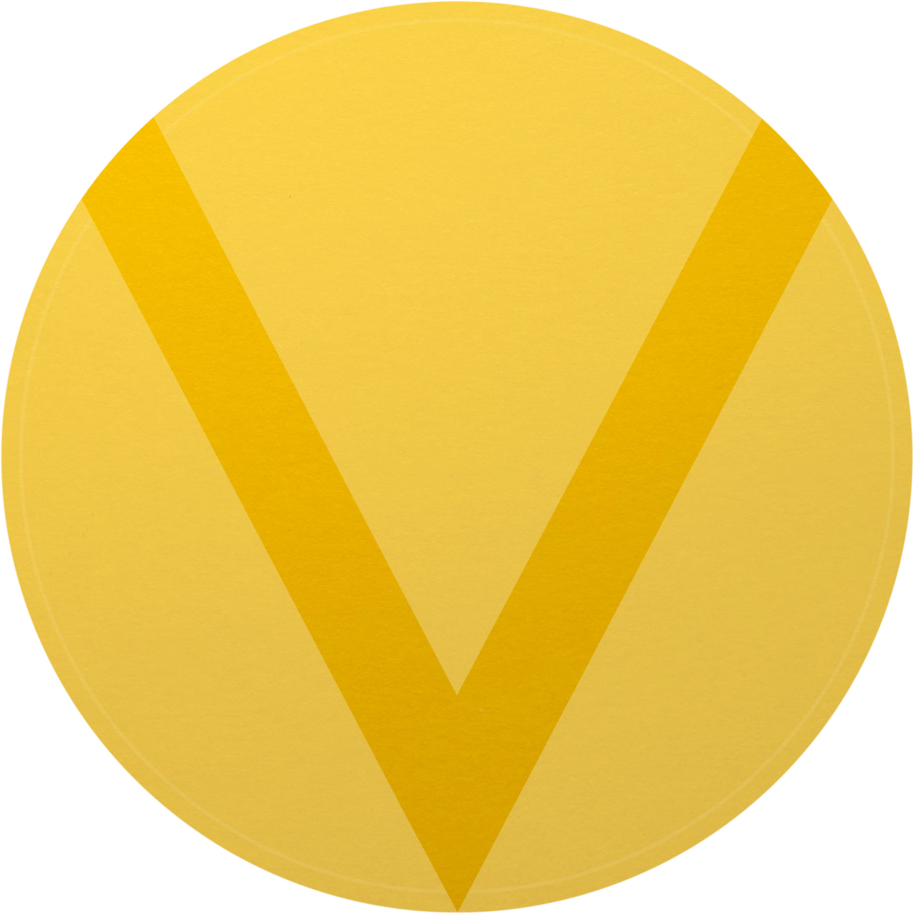
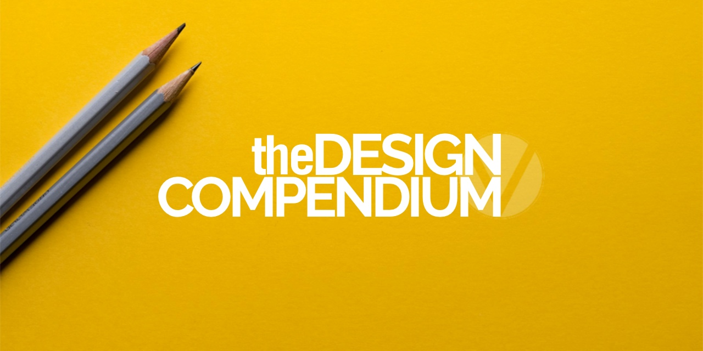

<div align="center">
    <br>
    
    <br>
    <h1>.studio</h1>
    <i>Access a repository of resources of all types to improve
        <br> the visual representation of your projects.
    </i>
    <br>
</div>

<div align="center">
    <a href="https://blog.ephemeralrogue.xyz/the-design-compendium">
        Project Writeup
    </a>
    •
    <a href="https://bsky.app/profile/lvnacy.xyz/">L V N A C Y Bluesky</a>
    •
    <a href="https://discord.gg/nh7mqGEfbw">L V N A C Y Discord</a>
    •
    <br>
</div>
<br>
<br>

# Contents
- [High Level](#high-level)
- [Project Overview](#project-overview)
- [.studio](#studio)
- [Why?](#why)
- [TODO](#todo)
- [Contributing to the Project](#contributing)
    - [Bot Stack](#bot-stack)
    - [Getting Started](#getting-started)
<br>
<br>
<div align='center'>
    
</div>
<br>

# high level
The Design Compendium is a resource for graphic designers and developers. When completed, this will present a simple frontend where users can select a tag and be served resources centered around that tag in the realms of design and code.


[Back to Contents](#contents)

# project overview
The Design Compendium consists of three parts:

1. **.compendium**: the database containing the resource documents
2. **.accumulator**: the method by which CRUD operations are run on **.compendium**
3. **.studio**: the frontend to display tags and resources

![sketch of project design. Three circles are super imposed over a rectangle. Inside the rectangle is the title of the project. The bottom circle holds a sketch of a cylinder with the MongoDB logo; above it is the graphQL logo. The word '.compendium' is written along the outside of the circle. The circle to the upper right has the Discord logo inside it with the word '.accumulator' written along the outside. Arrows connect the cicles to describe the relationship between the two. The third circle sits to upper left of the first and contains the Next.js logo with the word '.studio' circumscribed along the outside. Arrows connect this circle with the first to describe their relationship.](./assets/design-compendium-workflow-2.png "Design Compendium workflow diagram")

The GraphQL API is built into the Next.js app, using the routing system. Right 
now, the front end and API is intertwined. Part of the roadmap includes 
decoupling the two, so any database may be used, and a REST API may be 
substituted if preferred.

For details on the frontend and API, see [**.studio**][studio].

[Back to Contents](#contents)

# .studio
This is **.studio**, the frontend gallery for The Design Compendium. It will 
be designed to interface with **.compendium** through a GraphQL endpoint 
set to read-only: `GET` is its sole purpose. CRUD operations will be handled 
via [**.accumulator**](accumulator); see that repository for more details.

**.studio** is currently in development and not yet active. The domain is up 
and running, though all that is displayed at the moment is Next.js 
boilerplate. The GraphQL endpoint is active though currently not connected to 
**.compendium**. `typeDefs` are written for the schema; the resolvers still 
need to be written.

> [!IMPORTANT]
> Major blocker atm is having data to query. Once **.accumulator** is up and 
> running, test resources will be inserted and development may continue here.

[Back to Contents](#contents)

# why?
Why the fuck am I doing this? I needed something to motivate me to actually 
learn frontend development. Also, I got tired of running through lists of 
resources and finding them poorly vetted. Some of the READMEs out there, while 
fairly comprehensive, are incredibly outdated.

Why the fuck is this thing designed this way? I settled on this project design 
as a way to play with and understand relationships between different parts. 
This isn't quite a microservices-oriented system, but it also isn't a 
self-composed project. In addition to the parts that move data around are the 
layers of interaction above the app, those conversations I hope will take 
place around resource submissions and discussions.

[Back to Contents](#contents)

# TODO

- ~~add MongoDB connection~~
- write GraphQL resolvers to retrieve data
- write algorithm to display resources by tag
- make the frontend pretty

[back to Contents](#contents)

# Contributing
With regard to the general development of what currently exists here:

This is a [Next.js](https://nextjs.org) project bootstrapped with [`create-next-app`](https://nextjs.org/docs/app/api-reference/cli/create-next-app).

First, run the development server:

```bash
pnpm dev
```

Open [http://localhost:3000](http://localhost:3000) with your browser to see the result.

You can start editing the page by modifying `app/page.tsx`. The page auto-updates as you edit the file.

This project uses [`next/font`](https://nextjs.org/docs/app/building-your-application/optimizing/fonts) to automatically optimize and load [Geist](https://vercel.com/font), a new font family for Vercel.

## Learn More

To learn more about Next.js, take a look at the following resources:

- [Next.js Documentation](https://nextjs.org/docs) - learn about Next.js features and API.
- [Learn Next.js](https://nextjs.org/learn) - an interactive Next.js tutorial.

You can check out [the Next.js GitHub repository](https://github.com/vercel/next.js) - your feedback and contributions are welcome!

## Deploy on Vercel

The easiest way to deploy your Next.js app is to use the [Vercel Platform](https://vercel.com/new?utm_medium=default-template&filter=next.js&utm_source=create-next-app&utm_campaign=create-next-app-readme) from the creators of Next.js.

Check out our [Next.js deployment documentation](https://nextjs.org/docs/app/building-your-application/deploying) for more details.

[back to Contents](#contents)

<!-- Links -->
[accumulator]: https://github.com/ephemeralrogue/.accumulator
